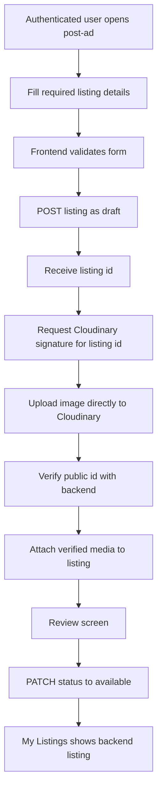
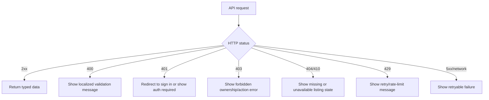
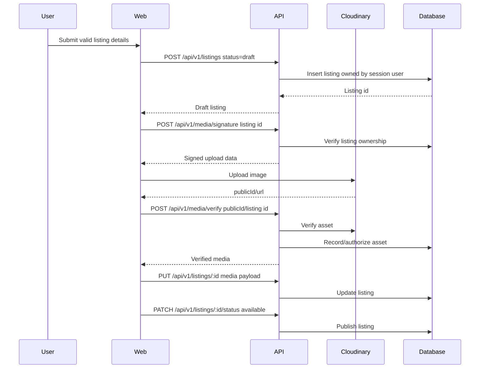
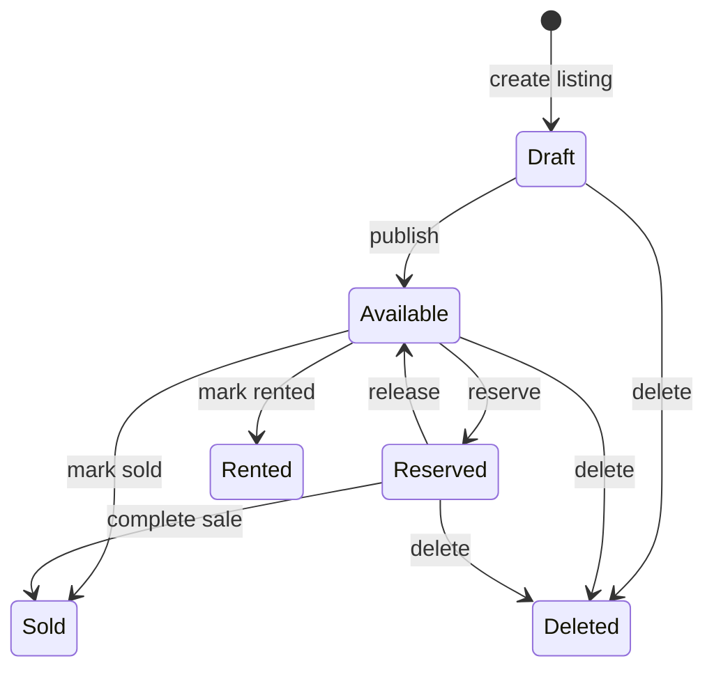

# Web Listing Management Design Spec - 2026-09-24

## Decision

Implement option 1: a wizard-first listing supply path that makes authenticated users able to create, upload media for, review, publish, manage, edit, change status, and delete their own marketplace listings.

This phase targets the buyer/seller marketplace loop. It does not implement paid promotions, subscriptions, chat, admin moderation, dealer inventory bulk tools, or SEO/CMS work.

## Goals

- Replace mock authenticated listing management with backend-backed flows.
- Use backend-owned auth, validation, authorization, status transitions, media signing, media verification, and delete cleanup.
- Preserve English/Arabic routes and RTL support.
- Keep the frontend typed, small, and aligned with current route/component patterns.
- Record each completed implementation block in `docs/web-frontend-handoff-2026-09-24.md`.

## Non-Goals

- No parallel image storage path. Use Cloudinary signed upload endpoints only.
- No raw client-provided redirect targets.
- No frontend-only ownership assumptions. Ownership is enforced by backend endpoints.
- No new heavy state framework. TanStack Query is sufficient for server state.
- No broad visual redesign beyond adapting existing post-ad/dashboard screens to real data.

## Backend Contracts

Listing create/update accepts these fields through existing schemas:

- Required: `categoryId`, `countryId`, `cityId`, `title`, `description`, `price`
- Optional identity/filter fields: `makeId`, `modelId`, `districtId`
- Optional listing state/data: `currency`, `status`, `lat`, `lng`, `year`, `mileage`, `transmission`, `fuelType`, `condition`, `specs`, `media`, `rentalPeriod`
- Status patch accepts only: `draft`, `available`, `reserved`, `sold`, `rented`

Media endpoints require:

- `POST /api/v1/media/signature`: `{ entityType: "listing", entityId: string }`
- `POST /api/v1/media/verify`: `{ publicId: string, entityType: "listing", entityId: string }`

Required API endpoints for this phase:

- `POST /api/v1/listings`
- `GET /api/v1/listings/me`
- `GET /api/v1/listings/manage/:id`
- `GET /api/v1/listings`
- `GET /api/v1/listings/:id`
- `PUT /api/v1/listings/:id`
- `PATCH /api/v1/listings/:id/status`
- `DELETE /api/v1/listings/:id`
- `POST /api/v1/media/signature`
- `POST /api/v1/media/verify`
- Taxonomy and location reads for categories, makes, models, countries, cities, districts

## Core Constraint: Media Needs A Listing Id

The backend signature endpoint requires `entityId`, and the project rules require ownership verification whenever a user references an entity by id. Therefore the create flow must create a draft listing before media upload.

Rejected alternative: upload media first with a temporary client id. That would either bypass backend entity ownership or require a new backend concept not currently present.

## Backend Read Constraint

Public listing reads intentionally expose only available listings. Owner listing management needs authenticated read endpoints that can return the current user's draft, reserved, sold, rented, pending, rejected, or banned listings without changing public marketplace behavior.

Required owner endpoints:

- `GET /api/v1/listings/me`: authenticated list of the current user's listings, with optional status filtering.
- `GET /api/v1/listings/manage/:id`: authenticated owner/admin detail read for any lifecycle status.

## User Flow

## Frontend Architecture

### API Layer

Add typed API helpers for:

- listing list/detail/create/update/delete/status patch
- media signature and verification
- taxonomy/location queries needed by the form

All helpers must:

- parse JSON defensively
- propagate structured backend errors `{ error, code, details? }`
- reject non-2xx responses with a typed application error
- never spread unknown backend rows into public UI models

### Server State

Use TanStack Query for:

- taxonomy/location option caching
- listing detail query
- my listings query filtered to the current user/session where supported
- create/update/status/delete mutations
- media signature/verify mutations

Mutation invalidation:

- create success invalidates my listings and listing search/list queries
- update success invalidates listing detail and my listings
- status success invalidates listing detail and my listings
- delete success invalidates my listings and listing search/list queries

### Form Model

Use one shared listing form schema/state mapper for create and edit.

Form sections:

- category and vehicle identity
- title, description, condition
- price, currency, rental period where relevant
- year, mileage, transmission, fuel type
- location: country, city, optional district, optional lat/lng
- specs as a constrained JSON-compatible object
- media collection
- review and publish

Client validation should mirror backend minimums, but backend validation remains authoritative.

### Create Flow

Create page behavior:

1. Require an authenticated session before form interaction.
2. Load taxonomy/location options.
3. Validate required fields locally.
4. Submit a draft listing with all known non-media fields.
5. Upload selected media using backend signatures scoped to the created listing id.
6. Verify each uploaded asset.
7. Update the draft listing with verified media.
8. Show review.
9. Publish with `PATCH /api/v1/listings/:id/status` to `available`.

Partial failure rule:

- If draft creation succeeds but media upload fails, preserve the draft id and keep the user in the media step with retry actions.
- If individual media verification fails, exclude that file from the media payload and show a per-file error.
- If publish fails, keep the listing as draft and show the backend error.

### Edit Flow

Edit page behavior:

1. Load listing detail by id.
2. Backend decides whether user is authorized.
3. Pre-fill the shared form model.
4. New media uploads are signed and verified against the existing listing id.
5. Existing media can be reordered or removed in the form payload if backend supports it through listing update.
6. Save via `PUT /api/v1/listings/:id`.

### My Listings

Dashboard listing management replaces mock data with backend query results.

Required actions:

- open public listing
- edit
- change status: draft, available, reserved, sold, rented where valid for current state
- delete with confirmation

Use pending states instead of optimistic status/delete updates for this phase. Refetch after success to avoid showing an unauthorized or rejected state transition as completed.

## Error Handling

Rules:

- Never show success on failed mutation.
- Preserve user-entered form state after recoverable errors.
- Prefer backend `error` and `code` fields; map known codes to localized UI strings.
- Unknown errors get a safe generic localized message.

## Data Flow

## State Model

The frontend must not invent additional statuses. If backend rejects a transition, keep current state and show the error.

## Security

- Session is required for create/edit/status/delete/media actions.
- Backend ownership checks are mandatory for every listing id mutation.
- Cloudinary upload signing must be requested per listing id.
- Media verify must run before media is attached to listing state.
- Public UI models must use explicit field mappings.
- Delete must call backend delete endpoint so application-level external cleanup can run.

## Verification

Required before marking implementation complete:

- `cd web && bun run check`
- `cd web && bun run build`
- Browser verification in English LTR and Arabic RTL
- Create draft listing
- Upload and verify at least one image with backend running
- Publish listing
- Confirm listing appears in My Listings from backend data
- Edit listing fields and media
- Change listing status
- Delete listing
- Confirm failed API mutations do not show success

## Implementation Recording

After each completed block, update `docs/web-frontend-handoff-2026-09-24.md` with:

- files changed at a high level
- behavior completed
- verification run
- remaining gaps or blockers

## Review Gate

This spec is the current approved direction, but implementation should start only after a short implementation plan is written from this spec.
