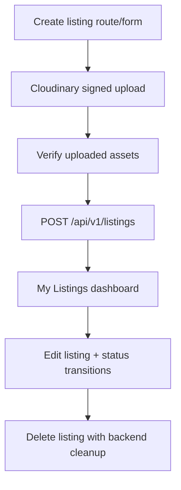

# Sayaratak Web Frontend Handoff — 2026-09-24

## Current State

Backend is treated as MVP-complete. Web frontend is a design-rich scaffold with partial backend integration. Phase 1 frontend hardening was completed to make the web app safer and buildable before deeper integration work.

## Completed

Security and correctness:
- Dashboard auth guard now fails closed. Failed session retrieval no longer creates a mock authenticated user.
- Report submission no longer shows success when `/api/v1/reports` fails.
- Report dialog now shows a localized error message on submission failure.
- Pakistan city fixture data was replaced with Sudan city data.

Tooling:
- Biome schema updated from `2.2.4` to `2.4.5`.
- Biome was scoped away from generated/shared UI primitives and Tailwind CSS files that produced parser/a11y false positives.
- Biome autofix was run, which formatted many existing web files.
- Blocking frontend check errors were cleared.

Accessibility/build fixes:
- Added missing button `type="button"` attributes in interactive UI.
- Converted clickable gallery/map containers from non-interactive `div`s to buttons.
- Added titles/labels to inline SVGs used as images.
- Added ids/labels or aria labels to several filter controls.
- Removed some unused imports/variables that were blocking checks.

Verification:
- `cd web && bun run check` passes.
- `cd web && bun run build` passes.

## Important Caveat

The worktree was already heavily dirty before this session. Do not assume every changed file in `git status` came from Phase 1. Biome formatting also touched many web files mechanically.

Before committing, review the web diff carefully and separate mechanical formatting from semantic changes if the team wants smaller commits.

## Remaining Warnings

`bun run check` exits successfully but still reports warnings. Main categories:
- Prototype/mock components with unused translation variables.
- Some checkbox/radio wrapper labels that Biome does not understand well with Base UI primitives.
- Index keys in static/mock arrays and skeleton placeholders.

These warnings are non-blocking right now, but should be cleaned up while replacing mock screens with real backend data.

## Remaining Product Gaps

Hard blockers for production:
- Post-ad/listing creation flow is not implemented end-to-end.
- Edit listing flow is not implemented end-to-end.
- Cloudinary signed upload flow is not wired into listing/profile forms.
- Dashboard pages still use mock/static data.
- Admin dashboard is mostly placeholder.
- Dealership/workshop/mechanic directories still use mock data.
- Public profile detail pages for dealership/workshop/mechanic are missing.
- Saved searches UI does not persist to backend.
- Chat, notifications, payments, subscriptions, CMS pages, and SEO metadata are not wired end-to-end.
- Map page uses static/mock map/listing behavior instead of backend map clusters.

Mock data still present:
- Public dealerships directory.
- Public workshops directory.
- Public mechanics directory.
- Listing detail related listings.
- Map fallback listings.
- Dashboard favorites/listings/messages/notifications and other dashboard pages.
- Listing query mock fallback remains opt-in behind `VITE_ENABLE_MOCK_DATA=true`.

## Recommended Next Phase

Build the real marketplace supply path first:

Acceptance criteria for next phase:
- No production mock fallback for authenticated listing management.
- Create listing validates required fields before submit.
- Media upload uses backend signed Cloudinary endpoints only.
- Created listing appears in My Listings from backend data.
- Edit listing persists changes via backend.
- Status transitions use backend endpoint.
- Delete calls backend delete endpoint.
- EN/AR and RTL layouts still work.
- `bun run check` and `bun run build` pass.

## Phase 2 Decision Recorded

User approved option 1: wizard-first listing creation and management.

Design spec recorded at:
- `docs/superpowers/specs/2026-09-24-web-listing-management-design.md`

Important architectural decision:
- Create the listing as `draft` before media upload.
- Use the created listing id for Cloudinary signature requests.
- Verify uploaded media against the backend before attaching it to the listing.
- Publish by patching listing status to `available`.

Reason:
- The backend media signature schema requires `entityId`.
- Project rules require ownership verification whenever a user references another entity by id.
- Draft-first avoids temporary client-owned upload identities and keeps authorization server-owned.

Current gate:
- Implementation plan has been written at `docs/superpowers/plans/2026-09-24-web-listing-management.md`.
- Current implementation should proceed task-by-task from that plan.
- After each completed implementation block, update this handoff with what changed, what was verified, and what remains.

### Phase 2 - Task 1 Completed

- Hardened frontend API parsing so empty/non-JSON responses do not crash structured error handling.
- Added listing management query keys and media signature keys.
- Added typed listing mutation payload/status/media types.
- Added listing create/update/status/delete helpers.
- Added backend-backed management listings query helper.
- Added media signature, Cloudinary upload, and backend verification helpers using the backend's actual signed parameter shape.
- Verification: `cd web && bun run check` exits 0 with existing warnings; `cd web && bun run build` exits 0.

### Phase 2 - Task 1A Completed

- Found and fixed a backend contract mismatch: public listing reads intentionally return only `available` listings, which could not support owner draft/edit management.
- Added authenticated `GET /api/v1/listings/me` for current-user listing management reads.
- Added authenticated `GET /api/v1/listings/manage/:id` for owner/admin listing detail reads across lifecycle statuses.
- Preserved public `GET /api/v1/listings/:id` behavior: non-available listings still return `410`.
- Added backend tests for no-session, owner draft list/detail, non-owner forbidden, and public 410 behavior.
- Updated frontend management query helpers to use `/listings/me` and `/listings/manage/:id`.
- Verification: `cd api && bun test tests/listings.test.ts` passed; `cd api && bun test` passed 129 tests; `cd web && bun run check` exits 0 with existing warnings; `cd web && bun run build` exits 0.

### Phase 2 - Task 2 Completed

- Added shared listing form Zod schema and `ListingFormValues`.
- Added safe optional numeric coercion so blank optional year/mileage/lat/lng fields remain undefined.
- Added default listing form values.
- Added mapper from form values to backend listing mutation payload.
- Added mapper from managed listing detail to edit form values.
- Preserved backend mutation status constraints while tolerating owner-read lifecycle statuses like `pending`, `rejected`, and `banned`.
- Verification: `cd web && bun run check` exits 0 with existing warnings; `cd web && bun run build` exits 0.

### Phase 2 - Task 3 Completed

- Added reusable controlled listing form component backed by taxonomy and location TanStack Query options.
- Added signed media uploader that requests backend signatures per file, uploads to Cloudinary, verifies with backend, and only appends verified assets.
- Added review/publish panel that shows listing summary and publish errors without fake success states.
- Added accessible id forwarding for form labels and controls.
- Verification: `cd web && bun run check` exits 0 with existing warnings; `cd web && bun run build` exits 0.

### Phase 2 - Task 4 Completed

- Added authenticated create listing route at `/dashboard/listings/new`.
- Implemented draft-first flow: details submit creates/updates `draft`, media step uploads against the draft id, review step publishes via status patch.
- Preserved draft id across media/publish failures so users can retry without losing form state.
- Added cache invalidation for public listing lists, owner management lists, and listing detail after draft/media/publish mutations.
- Added success state linking to public listing detail and My Listings.
- Updated high-traffic post-ad CTAs to target the new route.
- Verification: `cd web && bun run check` exits 0 with existing warnings; `cd web && bun run build` exits 0.

## Useful Backend Endpoints For Next Phase

- `POST /api/v1/media/signature`
- `POST /api/v1/media/verify`
- `POST /api/v1/listings`
- `GET /api/v1/listings`
- `GET /api/v1/listings/:id`
- `PUT /api/v1/listings/:id`
- `PATCH /api/v1/listings/:id/status`
- `DELETE /api/v1/listings/:id`
- `GET /api/v1/taxonomy/categories`
- `GET /api/v1/taxonomy/makes`
- `GET /api/v1/taxonomy/models`
- `GET /api/v1/locations/countries`
- `GET /api/v1/locations/cities`
- `GET /api/v1/locations/districts`

## Suggested Work Order

1. Add typed API/query helpers for listing create/update/delete/status and media signature/verify.
2. Build shared listing form state/schema for create and edit.
3. Build media uploader using signed Cloudinary uploads.
4. Implement create listing page from the existing post-ad design screens.
5. Replace My Listings dashboard mock table with backend data.
6. Implement edit listing page.
7. Add status transition actions.
8. Add delete flow with confirmation.
9. Run check/build and browser verification in English and Arabic.
