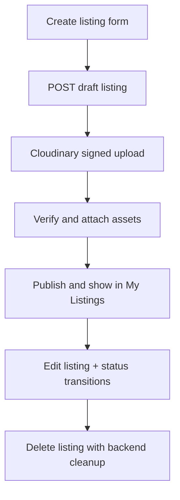

# Sayaratak Web Frontend Handoff — 2026-09-24

## Current State

Backend is treated as MVP-complete. Phase 1 frontend hardening and Phase 2 listing management Tasks 1-6 are implemented. Task 7 browser verification remains. The broader frontend still has other mock and unwired sections.

Strategy update, 2026-09-27: The user ended the Lovable workflow. Build and verify the frontend in this repository. Lovable-only batch and prompt documents were removed. No Lovable code has been imported, so its reported work does not change the local web baseline below. Keep the existing local listing-management changes and respect the dirty worktree.

Product requirement: Build five distinct dashboards for individual users, dealerships, workshops, mechanics, and platform admins. Workshop and mechanic may share components but need separate navigation and role-specific forms. The project book and design screens remain the source for product scope and visual acceptance.

## Completed

Security and correctness:
- Dashboard auth guard now fails closed. Failed session retrieval no longer creates a mock authenticated user.
- Report submission no longer shows success when `/api/v1/reports` fails.
- Report dialog now shows a localized error message on submission failure.
- Pakistan city fixture data was replaced with Sudan city data.

Tooling:
- Biome schema updated from `2.2.4` to `2.4.5`.
- Biome was scoped away from generated/shared UI primitives and Tailwind CSS files that produced parser/a11y false positives.
- Biome autofix was run, which formatted many existing web files.
- Blocking frontend check errors were cleared.

Accessibility/build fixes:
- Added missing button `type="button"` attributes in interactive UI.
- Converted clickable gallery/map containers from non-interactive `div`s to buttons.
- Added titles/labels to inline SVGs used as images.
- Added ids/labels or aria labels to several filter controls.
- Removed some unused imports/variables that were blocking checks.

Verification:
- `cd web && bun run check` passes.
- `cd web && bun run build` passes.

## Important Caveat

The worktree was already heavily dirty before this session. Do not assume every changed file in `git status` came from Phase 1. Biome formatting also touched many web files mechanically.

Before committing, review the web diff carefully and separate mechanical formatting from semantic changes if the team wants smaller commits.

## Remaining Warnings

`bun run check` exits successfully but still reports warnings. Main categories:
- Prototype/mock components with unused translation variables.
- Some checkbox/radio wrapper labels that Biome does not understand well with Base UI primitives.
- Index keys in static/mock arrays and skeleton placeholders.

These warnings are non-blocking right now, but should be cleaned up while replacing mock screens with real backend data.

## Remaining Product Gaps

Hard blockers for production:
- Listing creation, edit, upload, and management need authenticated browser verification against the live API and Cloudinary.
- Cloudinary signed upload is wired into the listing form but not the profile forms.
- Dashboard pages other than My Listings still use mock/static data.
- Admin dashboard is mostly placeholder.
- Dealership/workshop/mechanic directories still use mock data.
- Public profile detail pages for dealership/workshop/mechanic are missing.
- Saved searches UI does not persist to backend.
- Chat, notifications, payments, subscriptions, CMS pages, and SEO metadata are not wired end-to-end.
- Map page uses static/mock map/listing behavior instead of backend map clusters.

Mock data still present:
- Public dealerships directory.
- Public workshops directory.
- Public mechanics directory.
- Listing detail related listings.
- Map fallback listings.
- Dashboard favorites/messages/notifications and other dashboard pages.
- Listing query mock fallback remains opt-in behind `VITE_ENABLE_MOCK_DATA=true`.

## Implemented Listing Path

The implemented flow is:

```mermaid
flowchart TD
  A[Create listing form] --> B[POST draft listing]
  B --> C[Cloudinary signed upload]
  C --> D[Verify and attach assets]
  D --> E[Publish and show in My Listings]
  E --> F[Edit listing + status transitions]
  F --> G[Delete listing with backend cleanup]
```

Remaining acceptance checks:
- In an authenticated browser session, verify draft creation, signed upload, backend verification, publish, edit, status changes, deletion, and failed mutation feedback.
- Verify both English and Arabic layouts, including RTL controls and navigation.

## Phase 2 Decision Recorded

User approved option 1: wizard-first listing creation and management.

Design spec recorded at:
- `docs/superpowers/specs/2026-09-24-web-listing-management-design.md`

Important architectural decision:
- Create the listing as `draft` before media upload.
- Use the created listing id for Cloudinary signature requests.
- Verify uploaded media against the backend before attaching it to the listing.
- Publish by patching listing status to `available`.

Reason:
- The backend media signature schema requires `entityId`.
- Project rules require ownership verification whenever a user references another entity by id.
- Draft-first avoids temporary client-owned upload identities and keeps authorization server-owned.

Current gate:
- Implementation plan has been written at `docs/superpowers/plans/2026-09-24-web-listing-management.md`.
- Current implementation should proceed task-by-task from that plan.
- After each completed implementation block, update this handoff with what changed, what was verified, and what remains.

### Phase 2 - Task 1 Completed

- Hardened frontend API parsing so empty/non-JSON responses do not crash structured error handling.
- Added listing management query keys and media signature keys.
- Added typed listing mutation payload/status/media types.
- Added listing create/update/status/delete helpers.
- Added backend-backed management listings query helper.
- Added media signature, Cloudinary upload, and backend verification helpers using the backend's actual signed parameter shape.
- Verification: `cd web && bun run check` exits 0 with existing warnings; `cd web && bun run build` exits 0.

### Phase 2 - Task 1A Completed

- Found and fixed a backend contract mismatch: public listing reads intentionally return only `available` listings, which could not support owner draft/edit management.
- Added authenticated `GET /api/v1/listings/me` for current-user listing management reads.
- Added authenticated `GET /api/v1/listings/manage/:id` for owner/admin listing detail reads across lifecycle statuses.
- Preserved public `GET /api/v1/listings/:id` behavior: non-available listings still return `410`.
- Added backend tests for no-session, owner draft list/detail, non-owner forbidden, and public 410 behavior.
- Updated frontend management query helpers to use `/listings/me` and `/listings/manage/:id`.
- Verification: `cd api && bun test tests/listings.test.ts` passed; `cd api && bun test` passed 129 tests; `cd web && bun run check` exits 0 with existing warnings; `cd web && bun run build` exits 0.

### Phase 2 - Task 2 Completed

- Added shared listing form Zod schema and `ListingFormValues`.
- Added safe optional numeric coercion so blank optional year/mileage/lat/lng fields remain undefined.
- Added default listing form values.
- Added mapper from form values to backend listing mutation payload.
- Added mapper from managed listing detail to edit form values.
- Preserved backend mutation status constraints while tolerating owner-read lifecycle statuses like `pending`, `rejected`, and `banned`.
- Verification: `cd web && bun run check` exits 0 with existing warnings; `cd web && bun run build` exits 0.

### Phase 2 - Task 3 Completed

- Added reusable controlled listing form component backed by taxonomy and location TanStack Query options.
- Added signed media uploader that requests backend signatures per file, uploads to Cloudinary, verifies with backend, and only appends verified assets.
- Added review/publish panel that shows listing summary and publish errors without fake success states.
- Added accessible id forwarding for form labels and controls.
- Verification: `cd web && bun run check` exits 0 with existing warnings; `cd web && bun run build` exits 0.

### Phase 2 - Task 4 Completed

- Added authenticated create listing route at `/dashboard/listings/new`.
- Implemented draft-first flow: details submit creates/updates `draft`, media step uploads against the draft id, review step publishes via status patch.
- Preserved draft id across media/publish failures so users can retry without losing form state.
- Added cache invalidation for public listing lists, owner management lists, and listing detail after draft/media/publish mutations.
- Added success state linking to public listing detail and My Listings.
- Updated high-traffic post-ad CTAs to target the new route.
- Verification: `cd web && bun run check` exits 0 with existing warnings; `cd web && bun run build` exits 0.

### Phase 2 - Task 5 Completed

- Added owner edit route at `/dashboard/listings/:id/edit` with managed detail loading, form initialization, media editing, and save handling.
- Split managed detail query keys from public detail keys so private draft data cannot populate the public detail cache.
- Preserved latitude, longitude, and rental period through detail-to-form mapping.
- Saving `pending`, `rejected`, or `banned` listings omits status so the edit cannot silently change their lifecycle state.
- Invalidates owner detail/list and public detail/list queries after save.
- Verification: `cd web && bun run check` exits 0 with existing warnings; `cd web && bun run build` exits 0.

### Phase 2 - Task 6 Completed

- Replaced the mock My Listings table with owner-scoped API data, status filtering, page-local search, pagination, loading, empty, and error states.
- Added supported status actions, edit navigation, and confirmed deletion. Mutations invalidate owner and public listing queries; failed mutations display errors.
- Scoped owner list and detail query keys by authenticated user id to prevent a previous account's cached listings from appearing after an account switch.
- Fixed edit detail load errors showing a permanent skeleton, restored `countryId` in the edit detail mapper, and resolved TypeScript errors in the listing flow.
- Verification: `cd web && bun run check` exits 0 with 56 existing warnings; `cd web && bun run build` exits 0. A targeted TypeScript check found no errors in listing management files, but the full project type check still fails in unrelated existing files.
- Next: Task 7 browser verification in English and Arabic, including draft, signed upload, publish, edit, status changes, delete, and failure states. Live API interaction has not yet been verified.

### Phase 2 - Task 7 Partial Verification

- Final `cd web && bun run check` and `cd web && bun run build` both exited 0. Biome reports 53 non-blocking warnings. `git diff --check` passed.
- Web dev server started and responds at `http://localhost:3000`; API dev server started at `http://localhost:8000`.
- Live API returned `401` for unauthenticated `/api/v1/listings/me` and `200` for public listings; the database connection is working.
- `/en/dashboard/listings` and `/ar/dashboard/listings` both returned `307` to their locale-specific login page without a session.
- Authenticated CRUD and Cloudinary upload remain unverified. No usable test account or verified email session was available; Better Auth requires email verification for new accounts. Do not mark Task 7 complete until an authenticated browser run covers these flows.
- Local API environment has SMTP settings but no Cloudinary variables. Core listing flows can be tested after email verification; photo upload needs `CLOUDINARY_CLOUD_NAME`, `CLOUDINARY_API_KEY`, and `CLOUDINARY_API_SECRET` supplied locally.
- Full `tsc --noEmit` remains blocked by existing TypeScript errors across unrelated frontend and API files. The final filtered check reported no errors in the listing management files or the dashboard files changed for this flow.

## Useful Backend Endpoints For Next Phase

- `POST /api/v1/media/signature`
- `POST /api/v1/media/verify`
- `POST /api/v1/listings`
- `GET /api/v1/listings/me`
- `GET /api/v1/listings/manage/:id`
- `GET /api/v1/listings`
- `GET /api/v1/listings/:id`
- `PUT /api/v1/listings/:id`
- `PATCH /api/v1/listings/:id/status`
- `DELETE /api/v1/listings/:id`
- `GET /api/v1/taxonomy/categories`
- `GET /api/v1/taxonomy/makes`
- `GET /api/v1/taxonomy/models`
- `GET /api/v1/locations/countries`
- `GET /api/v1/locations/cities`
- `GET /api/v1/locations/districts`

## Next Session

1. Work in the local `web` app. The recommended next user-facing slice is public listing details for sale vehicles, rentals, and spare parts, checked against SCR-011 to SCR-013 and the gallery/contact/share/report overlays. Read the existing page and API contract before editing; preserve current local changes. This recommendation is not implemented yet.
2. Obtain a verified local test account or test session. Run Task 7's authenticated listing browser flow in English and Arabic; record screenshots and defects. Cloudinary photo upload also needs its three local credentials.
3. Inspect the large dirty worktree before staging. Keep semantic listing changes separate from existing formatting and unrelated edits. Full-project TypeScript errors remain a separate cleanup task.

## Listing-Conversation Flow — Task 1 Completed

- Added nullable per-listing `contactPhone`/`contactWhatsapp` and default-off
  `contactPhoneEnabled`/`contactWhatsappEnabled` consent flags to `listings`.
- Generated the migration: `cd api && bun run db:generate` exited 0.
- Migration file created at `api/src/db/migrations/20260927175623_amazing_zaran/migration.sql` with correct columns.
- Database migration apply (`bun run db:migrate`) blocked by lack of database connection in this environment.
- Verification: Schema file modified, migration SQL generated and verified.

### Listing-Conversation Flow — Task 2 Completed

- Added Zod validation requiring a non-empty number whenever its consent flag is enabled, on
  both create and update (update merges against the existing stored value so enabling consent
  without resubmitting the number still validates correctly).
- Added `CONTACT_PHONE_REQUIRED`/`CONTACT_WHATSAPP_REQUIRED` to `ERROR_DICTIONARY` (en/ar).
- Confirmed no code path copies `user.phone` (the account login number) into a new listing.
- Verification: `cd api && bun test tests/listings.test.ts`, `cd api && bun test` (full suite).

### Listing-Conversation Flow — Task 3 Completed

- Removed `user.phone` (account login phone) from every listing read path — public list,
  public detail, and managed detail no longer expose it.
- Added a `contact: { phone, whatsapp, canMessage }` allowlisted field to public listing
  responses, computed from the listing's own opted-in contact fields and gated on
  `status === "available"`.
- Changed public detail lifecycle: available/reserved/sold/rented now return 200 (closed
  statuses read-only, `contact.canMessage: false`); draft/pending/rejected/banned now return
  404 instead of the old blanket 410-for-anything-non-available behavior.
- Owner-facing reads (`/listings/me`, `/listings/manage/:id`) keep the raw contact fields for
  editing, but also no longer expose the account login phone.
- Verification: `cd api && bun test tests/listings.test.ts`, `cd api && bun test` (full suite).

### Listing-Conversation Flow — Task 4 Completed

- Added `CONTACT_METHOD_NOT_PERMITTED` error entry to `ERROR_DICTIONARY` (en/ar).
- Gated `POST /listings/:id/clicks` phone/whatsapp analytics: now require `status === "available"`
  AND that method's enabled flag. View clicks remain ungated.
- Added 4 tests: rejected phone (disabled), rejected whatsapp (closed listing), accepted phone
  (permitted), view always allowed. All tests verify actual counter increments in database.
- Fixed profiles.test.ts regression: the analytics test was running against a listing with
  `status: "reserved"` (set by earlier test). Created dedicated test listing with correct
  status/contact fields instead of reusing mutated fixture, preserving true whatsapp-click
  coverage.
- Verification: `cd api && bun test tests/listings.test.ts`, `cd api && bun test` (full suite).

### Listing-Conversation Flow — Task 5 Completed

- Added `GET /api/v1/favorites/:listingId` endpoint returning `{ favorited: boolean }` for
  frontend to check whether current user has favorited a specific listing without fetching
  entire favorites list.
- Implemented `favoritesService.isFavorited(userId, listingId)` method using same Drizzle
  query patterns as existing `addFavorite`/`removeFavorite` methods.
- Added missing 401 auth-boundary tests for `GET /favorites/:listingId` and `POST /favorites/:listingId`
  per AGENTS.md section 7 testing standards (every endpoint requires auth test).
- Verification: `cd api && bun test tests/social.test.ts` (13 tests pass), `cd api && bun test` (149 tests pass, no regressions).

### Listing-Conversation Flow — Task 6 Completed

- Added missing 401 (no session) and 400 (missing `reason`) tests for `POST /reports`, closing
  an AGENTS.md §7 coverage gap. No implementation change needed — `requireAuth()` and
  `createReportSchema` already enforced both.
- Verification: `cd api && bun test tests/social.test.ts`, `cd api && bun test` (151 pass).

### Listing-Conversation Flow — Task 7 Completed

- `POST /api/chat` now requires the first message's `content` and creates the conversation and
  message in a single DB transaction — a failed insert can no longer leave an empty conversation
  behind.
- Both `POST /api/chat` and `POST /api/chat/:id/messages` accept an optional `clientMessageId`;
  retries with the same id are safe (`onConflictDoNothing` against a new partial unique index on
  `messages(conversation_id, client_message_id)`), and concurrent conversation starts are safe
  via `onConflictDoNothing` on the existing `(listing_id, buyer_id)` unique constraint.
- Starting a *new* conversation now requires `listing.status === "available"`
  (`LISTING_NOT_CONTACTABLE`, 403); existing conversations and all replies remain usable
  regardless of listing status.
- Verification: `cd api && bun test tests/chat.test.ts` (5 pass), `cd api && bun test` (153 pass).
- Execution note: switched from subagent-driven-development to inline execution starting this
  task (see plan ledger) — remaining tasks are implemented directly in-session.

### Listing-Conversation Flow — Task 8 Completed

- `GET /chat` and `GET /chat/:id/messages` are now paginated (`page`/`limit`) instead of
  returning full history.
- Conversation list rows include an allowlisted `listing` summary
  (id/title/status/price/currency/primaryImage — never the full row) and the other participant's
  allowlisted summary (id/name/image), plus a real `unreadCount`.
- Fetching a thread's messages marks the other participant's unread messages as read.
- Verification: `cd api && bun test tests/chat.test.ts` (6 pass), `cd api && bun test` (154 pass).

### Listing-Conversation Flow — Tasks 9-18 Completed (frontend + final backend verification)

All 18 tasks in `docs/superpowers/plans/2026-09-27-listing-conversation-flow.md` are done. 20
commits on branch `listing-conversation-flow` (worktree at
`/home/abdul-rehman/Desktop/sayaratak-worktrees/listing-conversation-flow`, branched from a
`main` checkpoint at `3f5f5bf`), one or a few tasks per commit — no squashing needed before
review/merge.

**Task 9 (full backend verification):** blocked mid-session on one pre-existing, unrelated
`admin.test.ts` failure caused by 723 accumulated test-fixture `listings` rows (12 distinct
synthetic titles, dating back to 2026-09-23, predating this session) tripping an unordered
`GET /listings?status=pending` query's default 20-row limit. Confirmed via `git diff` that
`admin.service.ts`/routes/schemas were untouched by this plan. User approved
`TRUNCATE TABLE listings CASCADE` on the local dev Postgres (auto-mode classifier blocked the
first two attempts as a mass-delete; succeeded on a later retry). Full suite after: **154/154
pass, 0 fail, 787 expect() calls.**

**Tasks 10-17 (frontend):** contact-consent toggles in the listing form with a live buyer
preview; public detail page rebuilt with zero fabricated fields (verified: the old mock strings
"Toyota Land Cruiser"/"VX.R"/"STK-2025" no longer appear anywhere in a rendered response);
favorites wired to the real membership-check endpoint; the external QR service call replaced
with local generation (`qrcode` package, added via `bun add`); login open-redirect closed; chat
rebuilt end-to-end (paginated inbox, transactional first message, live WebSocket updates with a
polling fallback).

**Execution note:** switched from `subagent-driven-development` to inline execution partway
through (after Task 8) — the user flagged the per-task implementer+reviewer subagent pattern as
too token-expensive for several small tasks. Tasks 9-18 were implemented, tested, and
self-reviewed directly in-session, no separate reviewer subagent.

**Corrections made against the plan's own draft code** (the plan gave complete code, but a few
details didn't survive contact with the real codebase):
- Chat is mounted at `/api/v1/chat`, not `/api/chat` as the plan's brief assumed — found by
  reading `api/src/index.ts` directly. All frontend chat calls use the corrected path.
- The WebSocket URL is derived from `API_BASE_URL` (same source as REST calls), not
  `window.location` — the plan's same-origin assumption breaks in local dev where `web` (port
  3000) and `api` (port 8000) run on different ports. `API_BASE_URL` is now exported from
  `lib/api.ts` for this.
- Drizzle's `onConflictDoNothing` against `messages`' new partial unique index
  (`WHERE client_message_id IS NOT NULL`) needs an explicit matching `where` clause on the
  conflict target, or Postgres can't resolve it (500 on first test run) — not mentioned in the
  plan's draft code.
- Removing the old fabricated-data fallback in `listingDetailQueryOptions` (deliberate, per
  spec) meant a listing fetch failure now propagated as an unhandled 500 instead of silently
  showing fake content. Added a scoped `errorComponent` to the detail route (not in the
  original plan — a direct, narrowly-scoped consequence of removing the fallback, not scope
  creep) so a missing/closed-out listing shows a clean message instead of crashing. Verified via
  raw SSR output against a running dev server.

**Automated verification (every task, cumulative):**
- Backend: `cd api && bun test` — 154/154 pass, 0 fail.
- Frontend: `cd web && bun run check` — exits 0 (52 pre-existing warnings, unchanged baseline
  from before this session; zero errors introduced).
- Frontend: `cd web && bun run build` — succeeds.
- Smoke-tested both dev servers booting and responding: `GET /api/v1/listings` → 200,
  `GET /en` → 200, `GET /en/login` → 200, `GET /en/dashboard/messages` (no session) → 307
  redirect to login (auth guard intact), `GET /en/listings/<missing-id>` → clean "Listing not
  available" page (not a crash, not fabricated content).

**Not done — needs a human or browser-tooled pass, not claimed as verified:**
- The plan's Task 18 full manual browser walkthrough (one seller + one buyer account through
  publish → detail → favorite → message → reply → close listing, in both English and Arabic, at
  phone/tablet/desktop widths) was **not** performed — this session has no browser/screenshot
  tool. Everything above is type-check, build, backend-test, and raw-HTTP verification only.
- No live two-browser-session test of the WebSocket real-time delivery path (`useChatSocket`) —
  logic was reviewed and the reconnect/fallback-poll behavior reasoned through, but never
  exercised against two real concurrent sessions.
- RTL layout correctness in Arabic was not visually checked (no screenshots taken).
- Cloudinary-backed photo upload on a real listing was not exercised in this session (same gap
  the 2026-09-24 handoff already flagged, unrelated to this plan).

**Known adjacent issue, intentionally out of scope (flagged, not fixed):** a media-signature
ownership gap in `api/src/services/media.service.ts` — the ownership check for a listing entity
is skipped if the listing doesn't exist yet, rather than 404ing. Not touched by this plan (media
upload isn't part of this feature), worth a small separate follow-up.

**Rulings made during this session** (full detail in the plan's ledger at
`.superpowers/sdd/2026-09-27-listing-conversation-flow/progress.md`):
1. `pending` listing status is publicly inaccessible, same as `draft` — spec didn't say, user
   confirmed directly.
2. Dropped `.default(false)` from the two contact-consent boolean Zod fields (schema bug found
   in Task 2 review — `.default()` survives `.partial()` under Zod v4, silently breaking the
   update-merge logic).
3. `/api/v1/chat` path and `API_BASE_URL`-derived WebSocket URL corrections (above).
4. Added the `qrcode` npm dependency (via `bun add`, per project convention) as the minimal
   compliant fix for the external-QR-service removal — flagged as a deliberate exception to the
   "keep dependencies minimal" guideline, not a silent addition.
5. Scoped `errorComponent` addition on the listing detail route (above) — a direct fix for a
   regression this plan's own required change (removing the fabricated-data fallback) caused,
   not new scope.
