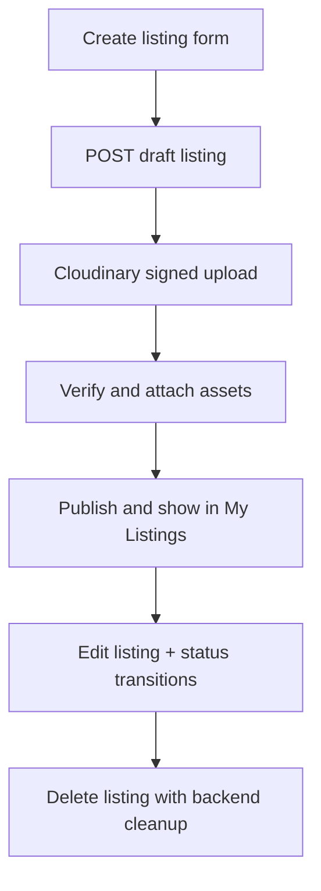

# Sayaratak Web Frontend Handoff — 2026-09-24

## Current State

Backend is treated as MVP-complete. Phase 1 frontend hardening and Phase 2 listing management Tasks 1-6 are implemented. Task 7 browser verification remains. The broader frontend still has other mock and unwired sections.

Strategy update, 2026-09-27: The user ended the Lovable workflow. Build and verify the frontend in this repository. Lovable-only batch and prompt documents were removed. No Lovable code has been imported, so its reported work does not change the local web baseline below. Keep the existing local listing-management changes and respect the dirty worktree.

Product requirement: Build five distinct dashboards for individual users, dealerships, workshops, mechanics, and platform admins. Workshop and mechanic may share components but need separate navigation and role-specific forms. The project book and design screens remain the source for product scope and visual acceptance.

## Completed

Security and correctness:
- Dashboard auth guard now fails closed. Failed session retrieval no longer creates a mock authenticated user.
- Report submission no longer shows success when `/api/v1/reports` fails.
- Report dialog now shows a localized error message on submission failure.
- Pakistan city fixture data was replaced with Sudan city data.

Tooling:
- Biome schema updated from `2.2.4` to `2.4.5`.
- Biome was scoped away from generated/shared UI primitives and Tailwind CSS files that produced parser/a11y false positives.
- Biome autofix was run, which formatted many existing web files.
- Blocking frontend check errors were cleared.

Accessibility/build fixes:
- Added missing button `type="button"` attributes in interactive UI.
- Converted clickable gallery/map containers from non-interactive `div`s to buttons.
- Added titles/labels to inline SVGs used as images.
- Added ids/labels or aria labels to several filter controls.
- Removed some unused imports/variables that were blocking checks.

Verification:
- `cd web && bun run check` passes.
- `cd web && bun run build` passes.

## Important Caveat

The worktree was already heavily dirty before this session. Do not assume every changed file in `git status` came from Phase 1. Biome formatting also touched many web files mechanically.

Before committing, review the web diff carefully and separate mechanical formatting from semantic changes if the team wants smaller commits.

## Remaining Warnings

`bun run check` exits successfully but still reports warnings. Main categories:
- Prototype/mock components with unused translation variables.
- Some checkbox/radio wrapper labels that Biome does not understand well with Base UI primitives.
- Index keys in static/mock arrays and skeleton placeholders.

These warnings are non-blocking right now, but should be cleaned up while replacing mock screens with real backend data.

## Remaining Product Gaps

Hard blockers for production:
- Listing creation, edit, upload, and management need authenticated browser verification against the live API and Cloudinary.
- Cloudinary signed upload is wired into the listing form but not the profile forms.
- Dashboard pages other than My Listings still use mock/static data.
- Admin dashboard is mostly placeholder.
- Dealership/workshop/mechanic directories still use mock data.
- Public profile detail pages for dealership/workshop/mechanic are missing.
- Saved searches UI does not persist to backend.
- Chat, notifications, payments, subscriptions, CMS pages, and SEO metadata are not wired end-to-end.
- Map page uses static/mock map/listing behavior instead of backend map clusters.

Mock data still present:
- Public dealerships directory.
- Public workshops directory.
- Public mechanics directory.
- Listing detail related listings.
- Map fallback listings.
- Dashboard favorites/messages/notifications and other dashboard pages.
- Listing query mock fallback remains opt-in behind `VITE_ENABLE_MOCK_DATA=true`.

## Implemented Listing Path

The implemented flow is:

```mermaid
flowchart TD
  A[Create listing form] --> B[POST draft listing]
  B --> C[Cloudinary signed upload]
  C --> D[Verify and attach assets]
  D --> E[Publish and show in My Listings]
  E --> F[Edit listing + status transitions]
  F --> G[Delete listing with backend cleanup]
```

Remaining acceptance checks:
- In an authenticated browser session, verify draft creation, signed upload, backend verification, publish, edit, status changes, deletion, and failed mutation feedback.
- Verify both English and Arabic layouts, including RTL controls and navigation.

## Phase 2 Decision Recorded

User approved option 1: wizard-first listing creation and management.

Design spec recorded at:
- `docs/superpowers/specs/2026-09-24-web-listing-management-design.md`

Important architectural decision:
- Create the listing as `draft` before media upload.
- Use the created listing id for Cloudinary signature requests.
- Verify uploaded media against the backend before attaching it to the listing.
- Publish by patching listing status to `available`.

Reason:
- The backend media signature schema requires `entityId`.
- Project rules require ownership verification whenever a user references another entity by id.
- Draft-first avoids temporary client-owned upload identities and keeps authorization server-owned.

Current gate:
- Implementation plan has been written at `docs/superpowers/plans/2026-09-24-web-listing-management.md`.
- Current implementation should proceed task-by-task from that plan.
- After each completed implementation block, update this handoff with what changed, what was verified, and what remains.

### Phase 2 - Task 1 Completed

- Hardened frontend API parsing so empty/non-JSON responses do not crash structured error handling.
- Added listing management query keys and media signature keys.
- Added typed listing mutation payload/status/media types.
- Added listing create/update/status/delete helpers.
- Added backend-backed management listings query helper.
- Added media signature, Cloudinary upload, and backend verification helpers using the backend's actual signed parameter shape.
- Verification: `cd web && bun run check` exits 0 with existing warnings; `cd web && bun run build` exits 0.

### Phase 2 - Task 1A Completed

- Found and fixed a backend contract mismatch: public listing reads intentionally return only `available` listings, which could not support owner draft/edit management.
- Added authenticated `GET /api/v1/listings/me` for current-user listing management reads.
- Added authenticated `GET /api/v1/listings/manage/:id` for owner/admin listing detail reads across lifecycle statuses.
- Preserved public `GET /api/v1/listings/:id` behavior: non-available listings still return `410`.
- Added backend tests for no-session, owner draft list/detail, non-owner forbidden, and public 410 behavior.
- Updated frontend management query helpers to use `/listings/me` and `/listings/manage/:id`.
- Verification: `cd api && bun test tests/listings.test.ts` passed; `cd api && bun test` passed 129 tests; `cd web && bun run check` exits 0 with existing warnings; `cd web && bun run build` exits 0.

### Phase 2 - Task 2 Completed

- Added shared listing form Zod schema and `ListingFormValues`.
- Added safe optional numeric coercion so blank optional year/mileage/lat/lng fields remain undefined.
- Added default listing form values.
- Added mapper from form values to backend listing mutation payload.
- Added mapper from managed listing detail to edit form values.
- Preserved backend mutation status constraints while tolerating owner-read lifecycle statuses like `pending`, `rejected`, and `banned`.
- Verification: `cd web && bun run check` exits 0 with existing warnings; `cd web && bun run build` exits 0.

### Phase 2 - Task 3 Completed

- Added reusable controlled listing form component backed by taxonomy and location TanStack Query options.
- Added signed media uploader that requests backend signatures per file, uploads to Cloudinary, verifies with backend, and only appends verified assets.
- Added review/publish panel that shows listing summary and publish errors without fake success states.
- Added accessible id forwarding for form labels and controls.
- Verification: `cd web && bun run check` exits 0 with existing warnings; `cd web && bun run build` exits 0.

### Phase 2 - Task 4 Completed

- Added authenticated create listing route at `/dashboard/listings/new`.
- Implemented draft-first flow: details submit creates/updates `draft`, media step uploads against the draft id, review step publishes via status patch.
- Preserved draft id across media/publish failures so users can retry without losing form state.
- Added cache invalidation for public listing lists, owner management lists, and listing detail after draft/media/publish mutations.
- Added success state linking to public listing detail and My Listings.
- Updated high-traffic post-ad CTAs to target the new route.
- Verification: `cd web && bun run check` exits 0 with existing warnings; `cd web && bun run build` exits 0.

### Phase 2 - Task 5 Completed

- Added owner edit route at `/dashboard/listings/:id/edit` with managed detail loading, form initialization, media editing, and save handling.
- Split managed detail query keys from public detail keys so private draft data cannot populate the public detail cache.
- Preserved latitude, longitude, and rental period through detail-to-form mapping.
- Saving `pending`, `rejected`, or `banned` listings omits status so the edit cannot silently change their lifecycle state.
- Invalidates owner detail/list and public detail/list queries after save.
- Verification: `cd web && bun run check` exits 0 with existing warnings; `cd web && bun run build` exits 0.

### Phase 2 - Task 6 Completed

- Replaced the mock My Listings table with owner-scoped API data, status filtering, page-local search, pagination, loading, empty, and error states.
- Added supported status actions, edit navigation, and confirmed deletion. Mutations invalidate owner and public listing queries; failed mutations display errors.
- Scoped owner list and detail query keys by authenticated user id to prevent a previous account's cached listings from appearing after an account switch.
- Fixed edit detail load errors showing a permanent skeleton, restored `countryId` in the edit detail mapper, and resolved TypeScript errors in the listing flow.
- Verification: `cd web && bun run check` exits 0 with 56 existing warnings; `cd web && bun run build` exits 0. A targeted TypeScript check found no errors in listing management files, but the full project type check still fails in unrelated existing files.
- Next: Task 7 browser verification in English and Arabic, including draft, signed upload, publish, edit, status changes, delete, and failure states. Live API interaction has not yet been verified.

### Phase 2 - Task 7 Partial Verification

- Final `cd web && bun run check` and `cd web && bun run build` both exited 0. Biome reports 53 non-blocking warnings. `git diff --check` passed.
- Web dev server started and responds at `http://localhost:3000`; API dev server started at `http://localhost:8000`.
- Live API returned `401` for unauthenticated `/api/v1/listings/me` and `200` for public listings; the database connection is working.
- `/en/dashboard/listings` and `/ar/dashboard/listings` both returned `307` to their locale-specific login page without a session.
- Authenticated CRUD and Cloudinary upload remain unverified. No usable test account or verified email session was available; Better Auth requires email verification for new accounts. Do not mark Task 7 complete until an authenticated browser run covers these flows.
- Local API environment has SMTP settings but no Cloudinary variables. Core listing flows can be tested after email verification; photo upload needs `CLOUDINARY_CLOUD_NAME`, `CLOUDINARY_API_KEY`, and `CLOUDINARY_API_SECRET` supplied locally.
- Full `tsc --noEmit` remains blocked by existing TypeScript errors across unrelated frontend and API files. The final filtered check reported no errors in the listing management files or the dashboard files changed for this flow.

## Useful Backend Endpoints For Next Phase

- `POST /api/v1/media/signature`
- `POST /api/v1/media/verify`
- `POST /api/v1/listings`
- `GET /api/v1/listings/me`
- `GET /api/v1/listings/manage/:id`
- `GET /api/v1/listings`
- `GET /api/v1/listings/:id`
- `PUT /api/v1/listings/:id`
- `PATCH /api/v1/listings/:id/status`
- `DELETE /api/v1/listings/:id`
- `GET /api/v1/taxonomy/categories`
- `GET /api/v1/taxonomy/makes`
- `GET /api/v1/taxonomy/models`
- `GET /api/v1/locations/countries`
- `GET /api/v1/locations/cities`
- `GET /api/v1/locations/districts`

## Next Session

1. Work in the local `web` app. The recommended next user-facing slice is public listing details for sale vehicles, rentals, and spare parts, checked against SCR-011 to SCR-013 and the gallery/contact/share/report overlays. Read the existing page and API contract before editing; preserve current local changes. This recommendation is not implemented yet.
2. Obtain a verified local test account or test session. Run Task 7's authenticated listing browser flow in English and Arabic; record screenshots and defects. Cloudinary photo upload also needs its three local credentials.
3. Inspect the large dirty worktree before staging. Keep semantic listing changes separate from existing formatting and unrelated edits. Full-project TypeScript errors remain a separate cleanup task.

## Listing-Conversation Flow — Task 1 Completed

- Added nullable per-listing `contactPhone`/`contactWhatsapp` and default-off
  `contactPhoneEnabled`/`contactWhatsappEnabled` consent flags to `listings`.
- Generated the migration: `cd api && bun run db:generate` exited 0.
- Migration file created at `api/src/db/migrations/20260927175623_amazing_zaran/migration.sql` with correct columns.
- Database migration apply (`bun run db:migrate`) blocked by lack of database connection in this environment.
- Verification: Schema file modified, migration SQL generated and verified.
